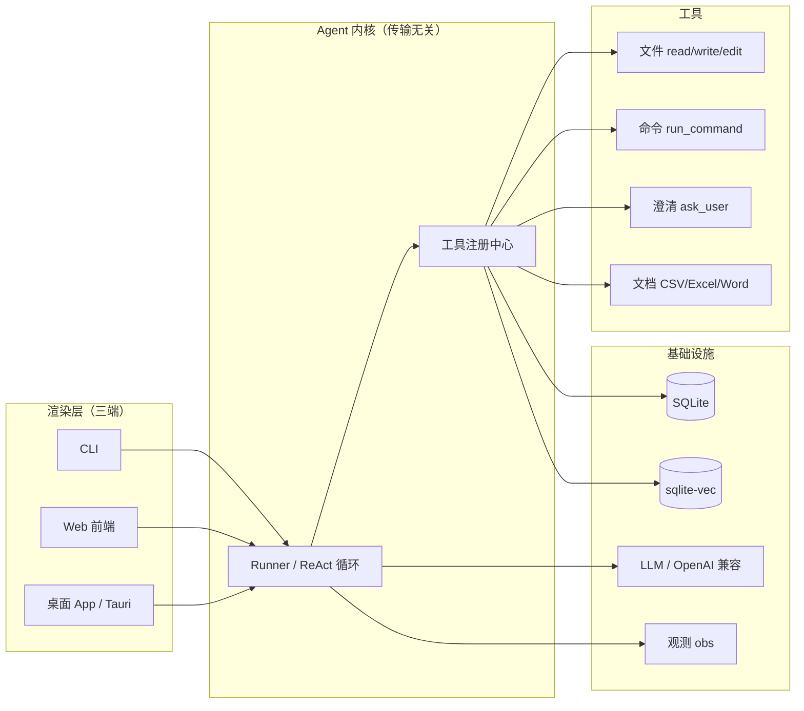

# mini-agent

A lightweight desktop task agent that understands natural-language instructions and acts on them: plans steps, reads/writes files, runs commands (with safety confirmation) and processes documents, via a ReAct loop + function calling (Python, LLM-powered).

> **mini-agent：轻量级桌面任务 Agent** 一个能听懂自然语言指令的桌面助手，自主规划任务步骤，操作文件（读取/编辑/创建）、执行命令（带安全确认）、处理文档（CSV/Excel/Word）。基于 **ReAct 循环（推理→行动→观察）** 与 **Function Calling** 实现，CLI / Web / 桌面三端共用同一套 agent 内核。

## 技术亮点

- **传输无关的 Runner 内核**：agent 核心只产出事件流（`chunk` / `tool_call` / `plan` / `done` / `error`），不 print、不碰 WebSocket。CLI、Web、桌面（Tauri）都只是 renderer，同一套 ReAct 循环三端复用。
- **ReAct 循环 + 流式 Function Calling**：流式 `tool_calls` 按 `index` 累积拼接再 `json.loads`；assistant(content+tool_calls) 与 role=tool 结果成对落历史，防止上下文丢失。
- **工具注册中心**：统一 schema 转 OpenAI function 定义，新增工具只需 `register(name, description, parameters, handler)`。
- **命令安全执行**：`run_command` 执行前走确认回调（永不超时），配危险命令黑名单、路径逃逸防护、prompt 注入防护。
- **澄清提问（ask_user）**：Agent 遇歧义主动提问，三态 + 超时（answered / declined / cancelled / timeout）。
- **可观测性**：每轮 LLM 延迟 / token / 步数埋点至 `logs/metrics.jsonl`，`/api/metrics` 聚合查询。
- **单文件存储**：SQLite（最近访问 + Session 历史）+ sqlite-vec（向量检索），零服务、clone 即用。

## 架构



## 快速开始

```bash
# 1. 安装依赖（需要 uv）
uv sync

# 2. 配置模型：编辑 configs/models.yaml，填 base_url / api_key / model
#    也可用环境变量覆盖 key，避免明文入库：
#    变量名规则 {模型名 非字母数字转下划线 大写}_KEY，例如 DEEPSEEK_CHAT_KEY
export DEEPSEEK_CHAT_KEY=sk-xxx

# 3. 启动 CLI
uv run python -m app.cli

# 4. 启动 Web 服务
uv run python -m app.main
# 打开 http://127.0.0.1:8000 ，健康检查 /api/health
```

## 使用示例

```bash
用户：读一下 ./docs/doc/plan.md
用户：把 README.md 里的 foo 改成 bar
用户：跑一下 ls ~/Documents
```

Web 端通过 WebSocket 对话，端点 `/api/chat/stream`；会话查询 `/api/sessions`。

## 功能状态

| 能力 | 状态 |
|---|---|
| ReAct 循环 + 流式 Function Calling | 已实现 |
| 文件读写（read_file / write_file / edit_file） | 已实现 |
| 命令执行（run_command + 确认） | 已实现 |
| 工具注册中心 | 已实现 |
| 可观测性（obs / metrics） | 已实现 |
| SQLite 会话存储 | 已实现 |
| 澄清提问 ask_user | 规划中（v2.2） |
| 文档处理（CSV/Excel/Word/md→HTML） | 规划中（v3.0） |
| 结构化输出（JSON mode） | 规划中（v3.0） |
| RAG 检索 + 混合检索 + rerank | 规划中（v4.2） |
| 效果评估 Eval | 规划中（v4.0） |
| 长期记忆 + 语义缓存 | 规划中（v4.4） |
| 桌面应用（Tauri） | 规划中（v5） |

详细路线见 [docs/doc/plan.md](docs/doc/plan.md)。

## Benchmark

> 待 Eval（v4.0）落地后补充。计划指标：任务成功率、平均步数、平均耗时、平均 token 成本、RAG 检索精度。

| 指标 | 值 | 说明 |
|---|---|---|
| 任务成功率 | - | 待 Eval |
| 平均 token 成本 | - | 待 Eval |
| 平均延迟 | - | 待 Eval |
| RAG 检索精度 | - | 待 Eval |

## 项目结构

```
app/
├── agent/            # ReAct 循环、事件、会话
├── api/              # FastAPI 路由 + WebSocket
├── config/           # 配置加载 + schema
├── llm/              # OpenAI 兼容客户端
├── store/            # SQLite 存储
├── tools/            # 工具 + 注册中心
├── cli.py            # CLI 入口
├── main.py           # Web 入口
└── obs.py            # 观测埋点
configs/              # 模型配置
docs/                 # 计划、ADR、提交记录
```

## 架构决策记录（ADR）

关键架构决策记录在 [docs/adr/](docs/adr/)，包括：

- 为什么 WebSocket 而非 SSE
- 为什么 sqlite-vec 而非 Chroma / pgvector
- 为什么 runner 保持传输无关

## License

[MIT](LICENSE)
