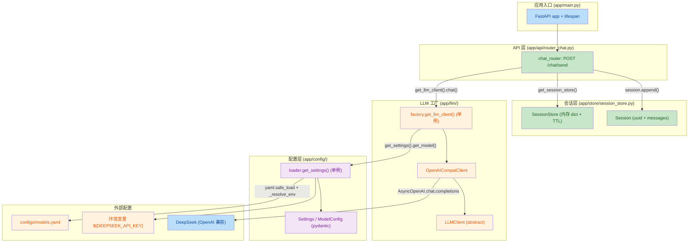
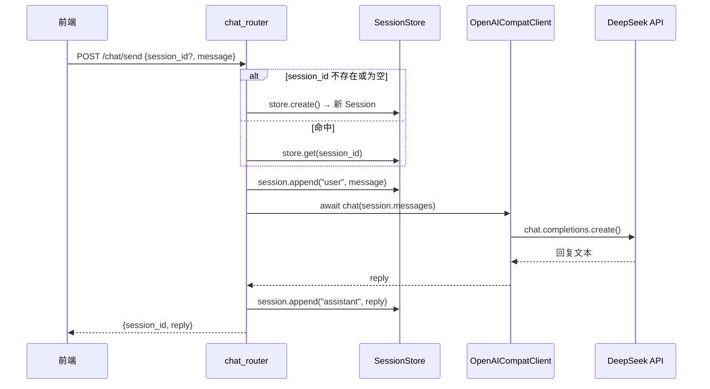

## 1. 高级摘要 (TL;DR)

*   **影响范围:** 🟢 **高** —— 本次为全新模块搭建,完成了 `mini-agent` v1（对话基座）从零到一的所有代码与配置,涉及 14 个新增文件。
*   **关键变更:**
    *   ✨ **FastAPI 后端骨架:** 新建 `app/main.py` 入口 + `app/api/router_chat.py` 聊天路由,实现 `POST /chat/send` 多轮对话。
    *   ✨ **LLM 客户端抽象 + OpenAI 兼容实现:** `app/llm/base.py` 抽象类 + `app/llm/openai_compat.py` 基于 `AsyncOpenAI` 的实现(支持 `chat` 与 `chat_stream`)。
    *   ✨ **配置体系:** `configs/models.yaml` + pydantic schema + 环境变量 `${VAR}` 解析,启动时校验 `api_key` 已设置。
    *   ✨ **会话存储:** `app/store/session_store.py` 内存 dict + TTL(默认 3600s)过期清理。
    *   📚 **完整方案文档:** `docs/plan.md` 涵盖 v1~v3 路线图、目录结构、数据协议与验收标准。

---

## 2. 可视化总览 (代码与逻辑地图)

**调用链路(一次聊天):**

---

## 3. 详细变更分析

### 🔧 3.1 应用入口 `app/main.py`
*   **变更内容:** 新建 `FastAPI` 应用 + `lifespan` 异步上下文(目前仅 `yield`,无启动/关闭逻辑)+ 挂载 `chat_router`。
*   **关键设计:** 单一 `include_router` 入口,后续新增路由只需追加一行。

### 🌐 3.2 API 层 `app/api/router_chat.py`
*   **新增端点:** `POST /chat/send`
*   **请求/响应结构:**

| 字段 | 位置 | 类型 | 必填 | 说明 |
|---|---|---|---|---|
| `session_id` | body | `str \| None` | 否 | 首次对话可不传,服务端自动创建 |
| `message` | body | `str` | 是 | 用户消息 |
| `session_id` | response | `str` | 是 | 会话 ID(新创建时返回) |
| `reply` | response | `str` | 是 | LLM 完整回复 |

*   **错误处理:** LLM 调用异常 → `HTTPException(502, "LLM 调用失败: {e}")`。

### ⚙️ 3.3 配置层 `app/config/`
*   **`schema.py`** —— pydantic 数据模型:

| 类 | 字段 | 类型 | 默认 | 说明 |
|---|---|---|---|---|
| `ModelConfig` | `name` | `str` | - | 模型标识 |
| | `provider` | `str` | `"openai_compat"` | 提供方路由 |
| | `base_url` | `str` | - | API 根地址 |
| | `api_key` | `str` | - | 密钥(支持 `${ENV}`) |
| | `model` | `str` | - | 实际模型名 |
| `Settings` | `default` | `str` | - | 默认模型名 |
| | `models` | `list[ModelConfig]` | - | 模型列表 |
| | `get_model(name=None)` | method | - | 按名取模型,未找到抛 `ValueError` |

*   **`loader.py`** —— 加载流程:
    1. `__file__` 定位 `configs/models.yaml`(不依赖 cwd)
    2. `_resolve_env()` 递归替换 `${VAR}`
    3. `Settings.model_validate()` pydantic 校验
    4. **快速失败:** 若 `api_key` 仍含 `${` → `RuntimeError("模型 {name} 的 api_key 环境变量未设置")`
    5. `get_settings()` 单例缓存

### 🤖 3.4 LLM 层 `app/llm/`
*   **`base.py`** —— 抽象接口:

| 方法 | 签名 | 用途 |
|---|---|---|
| `chat` | `async (messages: list[dict]) -> str` | 非流式,返回完整回复 |
| `chat_stream` | `(messages) -> AsyncIterator[str]` | 流式,逐段 yield 增量 |

*   **`openai_compat.py`** —— `OpenAICompatClient` 实现,支持非流式 + 流式两种模式(基于 `AsyncOpenAI`)。
*   **`factory.py`** —— `get_llm_client(model_name=None)` 单例,目前仅路由到 `OpenAICompatClient`;预留按 `config.provider` 扩展其他 provider 的注释。

### 💾 3.5 会话存储 `app/store/session_store.py`
*   **数据模型:**

| 字段 | 类型 | 说明 |
|---|---|---|
| `session_id` | `str` | `uuid.uuid4().hex` |
| `messages` | `list[dict]` | `[{"role": ..., "content": ...}]` |
| `updated_at` | `float` | `time.time()`,`append` 时刷新 |

*   **行为:** 内存 dict 存储;`get()` 时检查 TTL(默认 3600s),过期则 `del` 并返回 `None`;`get_session_store()` 单例。
*   **已知限制(v1 范围):** 进程重启即失;无并发锁保护;无主动清理后台任务(仅惰性删除)。

### 📦 3.6 依赖与配置

| 项目 | 详情 |
|---|---|
| Python | `3.12` (`.python-version`) |
| 包管理 | `uv` (生成 `uv.lock`) |
| `fastapi` | `>=0.141.1` |
| `openai` | `>=3.5.0` (兼容协议) |
| `pydantic` | `>=2.13.4` |
| `pyyaml` | `>=6.0.3` |
| `uvicorn[standard]` | `>=0.52.4` |
| 忽略规则 | `__pycache__/`、`.venv/`、`.env`、`.idea/`、`.vscode/` |

### 📝 3.7 配置文件 `configs/models.yaml`
*   **默认模型:** `deepseek-chat`
*   **已配置:** DeepSeek(`https://api.deepseek.com/v1` + `${DEEPSEEK_API_KEY}`)
*   **注释预留:** qwen-plus(dashscope)模板,用户可自行启用

### 📚 3.8 方案文档 `docs/plan.md`
*   三阶段路线图:v1 对话基座 → v2 文件+命令 → v3 ReAct+文档处理
*   明确每版的目录结构、协议格式、SQLite schema、任务清单与验收标准
*   划定边界:不做 Go 网关/ERP/多用户/桌面打包/Session 持久化

---

## 4. 影响与风险评估

### ⚠️ 4.1 风险点

| 风险 | 位置 | 说明 | 建议 |
|---|---|---|---|
| **配置未走 `app/` 包内导入** | `app/api/router_chat.py`、`app/llm/factory.py` 等 | 使用了 `from llm.factory` 而非 `from app.llm.factory`,需要 `pyproject.toml` 配置 `[tool.hatch.build.targets.wheel] packages` 或调整运行方式 | 后续要么补 `app/__init__.py` + 根目录运行,要么统一改为 `app.xxx` 绝对导入 |
| **流式接口未实际使用** | `app/llm/openai_compat.py:chat_stream` | 已实现但 `router_chat.py` 只调用非流式,前端计划文档要求流式 | v1.6 任务清单已含 WS 改造,需补 `/chat/stream` 路由 |
| **`api_key` 检查可能误报** | `app/config/loader.py:33-34` | 检查 `"${" in m.api_key`,但若环境变量值本身含 `${` 或 key 形如字面量 `${...}` 会被误判 | 改用 `m.api_key.startswith("${")` 或未解析则视为缺失 |
| **Session 内存锁** | `app/store/session_store.py` | FastAPI 异步下,dict 读写虽通常安全,但并发 `get` + TTL 过期 `del` 在 CPython GIL 下一般可接受,扩展时需注意 | v1 阶段可接受,v2+ 持久化时改为 SQLite |
| **`lifespan` 为空** | `app/main.py` | `yield` 前后无任何启动/关闭逻辑,无健康检查 | 计划文档要求 `GET /api/health`,后续补上 |

### 🔄 4.2 破坏性变更
*   无(全新项目,无既有调用方)。

### ✅ 4.3 测试建议

| 场景 | 验证点 |
|---|---|
| 首次对话 | 不传 `session_id` → 自动创建 → 返回新 ID |
| 多轮对话 | 传回 `session_id` → 上下文连续 → "刚才我说了什么" 能答对 |
| 缺失环境变量 | 不设 `DEEPSEEK_API_KEY` 启动 → 应立即 `RuntimeError`,而不是请求时才 401 |
| 配置错误 | `models.yaml` 写 `api_key: "硬编码"` → 不报错(只要无 `${`) |
| TTL 过期 | 等 3600s 或临时把 ttl 调成 5s 验证过期清理 |
| 多模型路由 | 临时启用 qwen 配置 + 设置 `DASHSCOPE_API_KEY` → 改 `default` 验证切换 |
| 流式接口 | 直接 `python -c "from app.llm.openai_compat import OpenAICompatClient; ..."` 单元测一下 |
| LLM 异常 | 改坏 `base_url` → 应返回 502 而非 500 |

### 🧭 4.4 后续路线(摘自 `docs/plan.md`)

| 版本 | 主题 | 关键新增 |
|---|---|---|
| v2 | 文件 + 命令 | 工具注册中心、`read/write/edit/run_command`、SQLite 记录最近访问、命令确认流 |
| v3 | ReAct + 文档 | `agent/runner.py` ReAct 循环、CSV/Excel/Word 工具、`md_to_html` |
| 后期 | Go 网关 / ERP | 独立规划 |