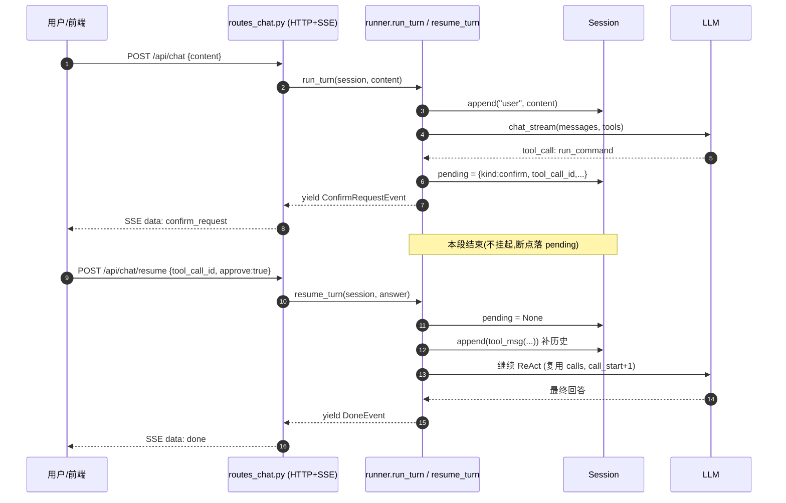

## 1. High-Level Summary (TL;DR)

*   **Impact:** 🟡 **High** —— 一次架构纠偏:Web 端传输协议由 WebSocket 改为 HTTP + SSE,runner 的"回调挂起模型"改为"回合断点 + 新请求续跑",直接影响所有 CLI / API / 文档。
*   **Key Changes:**
    *   ✨ 新增 `Session.pending` 断点字段;`runner.run_turn` 拆为 `run_turn` + `resume_turn`,遇需用户输入时存断点并结束本段,绝不挂起等回答。
    *   🔁删 WebSocket 端点,改为 `POST /api/chat` + `POST /api/chat/resume`,均用 `StreamingResponse(text/event-stream)` 推流。
    *   🛡️ 加历史一致性兜底:`_react` 的 `finally` 给未配对的 `tool_call` 补 `tool` 占位结果,避免断流后下次请求 400。
    *   📁 文件工具加 `list_recent_files`(内存 deque 占位),并把命令超时从 90s 收紧到 30s。
    *   📜 ADR-0002 记录选型纠偏,同步更新 plan / ADR-0001 标注废弃说明。

---

## 2. Visual Overview (Code & Logic Map)

```mermaid
graph TD
    subgraph 业务目标 ["业务目标"]
        G1["命令/提问需用户回答"]
        G2["传输层不耦合回合状态"]
        G3["流式输出体验"]
    end

    subgraph 模块 ["模块 / 文件"]
        M1["app/agent/runner.py"]
        M2["app/agent/session.py"]
        M3["app/agent/events.py"]
        M4["app/api/routes_chat.py"]
        M5["app/cli.py"]
        M6["app/store/session_store.py"]
        M7["app/tools/command.py"]
        M8["app/tools/file.py"]
    end

    subgraph 方法 ["关键方法"]
        F1["run_turn()"]
        F2["resume_turn()"]
        F3["_react()"]
        F4["_resolve_answer()"]
        F5["POST /api/chat"]
        F6["POST /api/chat/resume"]
        F7["_render()递归"]
    end

    G1 --> M1    G2 --> M1
    G2 --> M4
    G3 --> M1
    G3 --> M4

    M1 --> F1
    M1 --> F2
    M1 --> F3
    M1 --> F4
    M2 -->|"挂 pending 断点"|M1
    M3 -->|"ConfirmRequestEvent"|M1
    M4 --> F5
    M4 --> F6
    M5 --> F7
    M6 -->|"读 pending兜底"|M4
    M7 -->|"run_command 需 confirm"|M1
    M8 -->|"list_recent_files"|M1
```



---

## 3. Detailed Change Analysis

### 3.1 🧠 Agent Runner ——断点模型取代回调挂起

**`app/agent/runner.py`** 是本次核心改造点。

*   **去除 `confirm` 回调参数**:旧版 `run_turn(session, text, cfg=None, confirm=None)` 接收回调函数,内部用 `await confirm(cmd, cwd)` 挂起等回答;新版 `run_turn(session, text, cfg=None)` 改为纯事件流产出。
*   **拆分为 `run_turn` + `resume_turn`**:
    *   `run_turn`:首段,追加 `user` 消息 → 跑 `_react` →异常时回滚到 `start_len`。
    *   `resume_turn`:续段,从 `session.pending` 取出断点 → 比对 `tool_call_id` / `kind` 防串号 → 补 `tool_msg` 历史 → 复用 `call_index+1` 续跑。
*   **`_react(session, cfg, step_start, calls=None, call_start=0, stats=None)` 内部循环**:
    *   支持两种入口:正常轮(`calls is None` 先调 LLM 决策)与恢复轮(直接执行 `calls[call_start:]`)。
    *   遇 `c["name"] == "run_command"`:写 `session.pending`(含 `kind/step/call_index/calls/tool_call_id/name/args/created_at/expires_at`)→ yield `ConfirmRequestEvent` → `return` 结束本段。
*   **新增辅助函数**(均为私有):
    | 函数 | 作用 |
    |---|---|
    | `_tool_msg(tool_call_id, content)` | 构造 `role=tool` + `tool_call_id` 的完整消息,漏字段直接 API 400 |
    | `_assistant_msg(content, calls)` | `assistant(content+tool_calls)` 同条消息,`arguments` 写回要 `json.dumps` |
    | `_execute(c)` | 跑普通工具,异常时返回 `(f"工具执行失败: {e}", False)` 喂回模型自纠 |
    | `_resolve_answer(session, p, answer)` | 把对断点的回答译成 tool 结果;同时记 `confirm` 埋点(等待时长 + approved) |
    | `_log_turn(session, t0, stats, err)` | 回合埋点(耗时 / 步数 / 工具成败 / 错误) |
    | `_new_stats(steps=0)` | 初始化 stats 计数器 |
*   **🛡️ 历史一致性兜底**:`_react` 的 `finally` 遍历 `unpaired` 列表,给"本段被中途掐断(断流 / 异常 / 取消)时还没配对的 call"补 `_tool_msg(cid, "（中断，未执行）")`,否则下次请求 400。`run_turn` 的 `except` 会回滚消息,所以不需要补。
*   **改动类型**:🚨 类型 | 🛠 添加时间戳 | 📌 删 | 🔧 重命名

### 3.2 📡 Session / Events —— 字段增补与新事件类型

| 文件 | 改动 | 关键说明 |
|---|---|---|
| `app/agent/session.py` | ➕ `self.pending: dict \| None = None` | 断点状态挂会话上,一个会话同时只有一个活跃回合,够用 |
| `app/agent/events.py` | ➕ `ConfirmRequestEvent` 数据类 | `type/step/tool_call_id/cmd/cwd`,关联键复用 `tool_call_id` |

### 3.3 🌐 API Routes —— WebSocket → HTTP + SSE

**`app/api/routes_chat.py` 完全重写**,核心对照表:

| 维度 | 旧版 (WebSocket) | 新版 (HTTP + SSE) |
|---|---|---|
| 端点 | `WS /api/chat/stream` | `POST /api/chat`、`POST /api/chat/resume` |
| 传输 | 长连接双向 | 普通 HTTP + SSE 单向流 |
| 流格式 | JSON 帧 | `data: {json}\n\n` |
| 缓冲头 | 隐式 | ➕ `Cache-Control: no-cache` + `X-Accel-Buffering: no` 防 Nginx 攒批 |
| 请求体 | `{"type":"user_message",...}` | `ChatRequest{session_id?,content}` / `ResumeRequest{session_id,tool_call_id,kind,approve}` |
| 事件→SSE | 通用拼字段 | `_payload(ev, sid)` 按 `event.type` 映射字段(`chunk.content` / `tool_call.{step,name,args,result}` / `confirm_request.{step,tool_call_id,cmd,cwd}` / `error.message`) |

**`app/api/routes_sessions.py`**: `store.history()` 改为返回 `{messages, pending}`,`GET /api/sessions/{id}` 透传,断线重连后前端可据此重弹确认框。

### 3.4 🖥️ CLI —— 一问一答取代回调挂起

**`app/cli.py`** 重构:

*   旧版 `run_turn(..., confirm=_confirm)` → 新版 `run_turn(...)` + 遇 `confirm_request` 事件递归 `_render(session, resume_turn(...))`。
*   `_confirm(cmd, cwd) -> bool` 拆为 `_ask_yn() -> bool` + 事件处理器内构造 `answer` 字典(`tool_call_id` / `kind="confirm"` / `approve`)。
*   `KeyboardInterrupt` / `EOFError` 默认拒绝,行为更安全。
*   ⚠️ 原 2.6 "统一输入通道(单读线程 + 单 queue + 状态分发)"整节作废 —— 改断点模型后冲突消失,一个 `input()` 够用。

### 3.5 💾 SessionStore —— 修正拼写与现场恢复

**`app/store/session_store.py`**:

| 改动 | 说明 |
|---|---|
| 🔧 `SESSSION_TTL_SECONDS` → `SESSION_TTL_SECONDS` | 拼写修正(全局3 处) |
| 🔁 `list_sessions` 改为 `list(self.sessions)` 取 key 快照 →调 `self.get(sid)` 内部清理过期 | 避免遍历中改 dict |
| 🛡️ `s.messages[-1]["content"][:30]` → `s.messages[-1].get("content") or ""`[:30] | 防止 `tool_call` 消息没 `content` 键时崩溃 |
| 📦 `history()` 返回类型 `list[dict]\|None` → `dict\|None` | 新增 `pending` 字段透传 |

### 3.6 🛠️ Tools —— 超时收紧 + 新增 `list_recent_files`

| 改动 | 位置 | 说明 |
|---|---|---|
| ⏱️ `timeout=90` → `timeout=30` | `app/tools/command.py` | 注释明示"确认等待永不超时,工具自己的超时是另一件事";description 文案同步 |
| ➕ `_recent: deque(maxlen=200)` 模块级 | `app/tools/file.py` | 方案 A 内存占位,重启即空,v2.4 换 SQLite |
| ➕ `_record(op, path)` | `app/tools/file.py` | 仅在 `read_file` / `write_file` / `edit_file` 执行成功时调用 |
| ➕ `list_recent_files(limit=20)` | `app/tools/file.py` | 倒序取前 limit 条,返回 `最近访问（N 条,最新在前）:\n...` |

### 3.7 📜 文档同步

| 文件 | 改动 |
|---|---|
| `docs/adr/0001-core-architecture-decisions.md` | 状态改为"已接受(决策 1 已废止)";加废弃说明 callout;决策 3 描述更新为"注入 confirm 回调"已废止 |
| `docs/adr/0002-http-sse-over-websocket.md` | 🆕 新增 ADR,46 行,含选型纠偏复盘 + 教训清单 |
| `docs/doc/plan.md` | 大面积同步:1.1/v1.1 切片、1.2 技术栈、1.4 模块职责、1.5 事件协议、1.7 v2.1/v2.4 任务清单、2.5 confirm 协议(整段重写)、2.6 ask_user 协议(惰性超时)、2.7 ReAct 伪代码(断点版)、3.4 SSE 事件、6.6 ADR 索引、跨版本约定(最近访问存储) |

---

## 4. Impact & Risk Assessment

### 4.1 ⚠️ Breaking Changes

| 类别 | 旧接口 | 新接口 |
|---|---|---|
| HTTP 协议 | `WS /api/chat/stream` | `POST /api/chat`、`POST /api/chat/resume` |
| 消息格式 | JSON帧(双向) | SSE (`text/event-stream`) + HTTP POST 请求体 |
| Runner 签名 | `run_turn(session, text, cfg=None, confirm=None)` | `run_turn(session, text, cfg=None)` |
| Session 协议 | `(messages, session_id, created_at)` | `(messages, session_id, created_at, pending)` |
| 命令超时 | 90s | 30s |
| Confirm关联键 | 原计划 `confirm_id` | 复用 `tool_call_id`(更简单、更天然) |

### 4.2 🧪 Testing Suggestions

| 测试场景 | 验证要点 |
|---|---|
| **正常多轮对话** | CLI / curl SSE 都能跑通,追问"刚才说了什么"能答上 |
| **命令确认通过** | 输入 `rm -rf test` → 弹确认 → 输 `y` → 命令执行,结果落历史 |
| **命令确认拒绝** | 输 `n` → 历史里出现 `"用户拒绝执行该命令"`,Agent 收到后能继续 |
| **断点续跑** | 命令确认到一半 `Ctrl+C` → 重连 → `GET /api/sessions/{id}` 看到 `pending` → 再 resume |
| **历史配对完整** | 任何"提前结束"路径(取消 / 断流 / 异常)后,下一轮 LLM 请求不报 `tool_call_id` 缺失 |
| **超时归零** | `tool_call_id` 不匹配 / `kind` 不匹配 → 收到 `error` 事件不污染状态 |
| **新消息插队** | `pending` 未清时再发新消息 → `error: 还有待处理的确认/提问` |
| **`list_recent_files`** | 读 / 写 / 编辑文件后调用,按时间倒序,同一文件多次访问可多次出现 |
| **过期会话** | 6 小时无活动 → `list_sessions` / `history` 自动清理 |
| **SSE 中间层** | Nginx 后 `chunk` 是否仍逐字到达(`X-Accel-Buffering: no` 验证) |

### 4.3 📋 实施要点与依赖

*   ⚠️ **前端不能用 `EventSource`**:仅支持 GET,需用 `fetch` + `ReadableStream` 读 SSE。
*   ⚠️ **`plan.md` v2.1 内部顺序**:3(runner 断点模型) → 4(传输改造) → 5(CLI 改造),先把断点立起来,后续才有契约可依。
*   ✅ **可观察性**:`_log_turn` 仍每次记一条,断点恢复会分多段各记一条(便于统计)。
*   🔮 **v2.4 衔接**:`pending` 字段为后续 SQLite 落库(重启不丢、断点可续)铺好路。