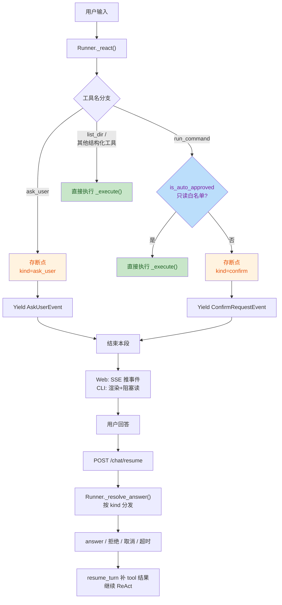
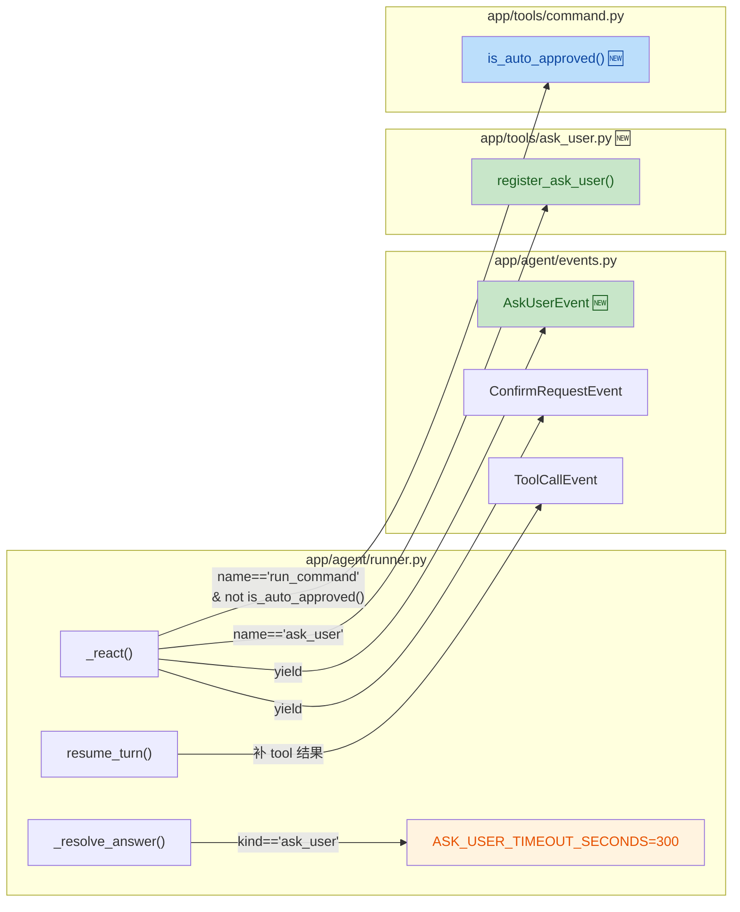

## 1. 高层级摘要 (TL;DR)

*   **影响程度：** ⚠️ **中高** —— 在 Agent 运行核心引入第二类人机交互（澄清提问），同时改写命令拦截策略。
*   **核心变更：**
    *   ✨ **新增 `ask_user` 工具**：Agent 在需求模糊/方案歧义时可主动提问澄清，复用同一套断点-恢复管道。
    *   🛡️ **只读命令自动白名单**：`ls`/`git status` 这类单条只读命令免确认（基于严格 shlex 分词+拒元字符）。
    *   ✨ **新增 `list_dir` 结构化只读工具**：查看目录结构不再走 shell，零注入面。
    *   🔧 **Runner / API / CLI 三端适配**：`_resolve_answer` 重构支持 `confirm | ask_user` 双 kind；`ResumeRequest` 扩字段；CLI 新增 `_ask_text`。

---

## 2. 视觉概览（代码与逻辑映射）

### 2.1 人机交互扩展后的整体流程



### 2.2 Runner 模块内部组件关系



---

## 3. 详细变更分析

### 3.1 🆕 新增组件：`AskUserEvent` + `ask_user` 工具

**文件**：`app/agent/events.py`、`app/tools/ask_user.py`

#### 新事件类型 `AskUserEvent`

| 字段 | 类型 | 必填 | 说明 |
|---|---|---|---|
| `type` | `str` | ✅ | 固定 `"ask_user"` |
| `step` | `int` | ✅ | 当前轮次（与 confirm 对齐） |
| `tool_call_id` | `str` | ✅ | **关联键**：与 confirm 一致，不另造 ID |
| `question` | `str` | ✅ | 提问正文 |
| `options` | `list` | ❌ | 候选答案列表，供前端按钮渲染 |
| `timeout_seconds` | `int` | ✅ | 默认 300 秒（仅 Web/SSE 生效） |

#### 新工具 `ask_user`

*   **函数签名**：`ask_user(question: str, options: list[str] | None = None) -> str`
*   **占位实现**：正常路径走不到（runner 会拦截存断点），保留实现方便单测工具本身。
*   **描述策略**：明确告诉模型"提问前先尽力自己查、一次最多 3-4 个问题"，避免连续追问。

---

### 3.2 ✨ 核心：`Runner._resolve_answer` 重构（双态变四态）

**文件**：`app/agent/runner.py`

| `kind` | 输入字段 | 状态枚举 | Tool 返回值 | 埋点 |
|---|---|---|---|---|
| `confirm` | `approve: bool` | `approved` / `rejected` | 成功结果 或 `"用户拒绝执行该命令"` | `confirm` event |
| `ask_user` 🆕 | `status`, `answer` | `answered` / `declined` / `cancelled` / `timeout` | 回答内容 / 拒绝提示 / 取消提示 / 超时提示 | `ask_user` event |

**关键设计要点：**

*   🔑 **显式 status 一律信任**：CLI 永远显式 `answered`（即使阻塞再久也不超时，**ADR-0004 决策2**）。
*   🔑 **Web 端过期后由前端发 `timeout`**（**ADR 决策4** 自动续跑）。
*   🔑 **后端惰性兜底**：仅在 `status` 缺失时根据 `expires_at` 判过期（不用定时器，省资源）。
*   🔑 **取消语义**：`cancelled` 时补齐 tool 结果（保持历史合法）后**直接 yield DoneEvent 收尾**。

---

### 3.3 🆕 新增工具：`list_dir`（结构化只读，免确认）

**文件**：`app/tools/file.py`

| 项 | 说明 |
|---|---|
| 函数 | `list_dir(path: str = ".") -> str` |
| 实现 | `pathlib.Path`，**无 shell**，零注入面 |
| 输出格式 | `path（共N项,目录在前）:\n条目列表（子目录名加 `/`）` |
| 截断策略 | 超过 200 项截断，防止 `node_modules` 这类爆上下文 |
| 工具描述 | "查看目录结构时优先用本工具，不要用 run_command 执行 ls/dir/find" |

> 💡 **核心思想**：把高频只读操作从 `run_command` 中独立成结构化工具，模型被引导优先用它，绕开所有 shell 风险。

---

### 3.4 🛡️ 核心安全变更：`is_auto_approved()` 严格命令白名单

**文件**：`app/tools/command.py`

#### 拒绝（绕过防御）

| 类别 | 内容 |
|---|---|
| `_FORBIDDEN_CHARS` | `;` `\|` `&` `<` `>` `` ` `` `$` `(` `)` `\n` `\r`（引号内出现也拒） |
| `shlex.split` 失败 | 引号未闭合直接判不批 |
| `_FIND_FORBIDDEN_OPTS` | `-exec` `-execdir` `-ok` `-okdir` `-delete` `-fprint*` `-fls*` |

#### 放行（精确匹配）

| 类型 | 集合 |
|---|---|
| 只读命令（20+ 个） | `ls` `pwd` `cat` `head` `tail` `grep` `rg` `find` `wc` `stat` `file` `which` `whereis` `echo` `date` `whoami` `hostname` `tree` `du` `df` `ps` `uptime` `uname` |
| `git` 只读子命令 | `status` `log` `diff` `show` `blame` `ls-files` |

#### 防御示例

|攻击向量 | 拦截点 |
|---|---|
| `ls; rm -rf ~` | `_FORBIDDEN_CHARS` 含 `;` |
| `ls && curl x \| sh` | `_FORBIDDEN_CHARS` 含 `&` `\|` |
| `ls $(reboot)` | `_FORBIDDEN_CHARS` 含 `$` `(` |
| `ls > /etc/passwd` | `_FORBIDDEN_CHARS` 含 `>` |
| `find . -delete` | `_FIND_FORBIDDEN_OPTS` 命中 |

> ⚠️ **设计原则**：「漏判不可接受、误伤可接受」（如 `ls \| grep` 这种安全复合被误伤，方向安全）。

---

### 3.5 🔧 API 路由扩展：`ResumeRequest` 新字段

**文件**：`app/api/routes_chat.py`

|字段 | 类型 | 用途 |
|---|---|---|
| `kind` | `str` | 扩展为 `confirm \| ask_user` |
| `approve` | `bool` | `confirm` 用（保留） |
| `status` 🆕 | `str \| None` | `ask_user` 用：`answered` / `declined` / `cancelled` / `timeout` |
| `answer` 🆕 | `str \| None` | `ask_user` 用：用户回答内容 |

`_payload()` 同步扩展，对 `ask_user` 事件输出 `step` / `tool_call_id` / `question` / `options` / `timeout_seconds`。

---

### 3.6 🔧 CLI 适配：新增 `_ask_text()`

**文件**：`app/cli.py`

*   `_render` 新增 `ev.type == "ask_user"` 分支：打印问题、列出选项、调用 `_ask_text()` 阻塞读一行。
*   `_ask_text()`：处理 `KeyboardInterrupt` / `EOFError`（Ctrl+C/D 返回"用户未回答"占位文本）。
*   **关键决策**：CLI 不做超时（**ADR-0004 决策2**），只阻塞读一行；pending 里 `status` 永远显式 `answered`。

---

### 3.7 📝 文档同步更新

| 文件 | 变更 |
|---|---|
| `docs/adr/0004-human-interaction-hybrid-pattern.md` | 🆕 新增**决策 7**：命令粒度的只读分级（结构化工具 + 严格白名单），含业界复查表（修正"业界不做白名单"的早先说法）。边界对照表从 6 项扩为 7 项。 |
| `docs/doc/plan.md` | 更新文件工具章节（加 `list_dir`）、命令执行章节（白名单说明）、检查清单勾选决策项 10。 |

---

## 4. 影响与风险评估

### 4.1 ⚠️ 破坏性变更

| 变更 | 影响 | 缓解措施 |
|---|---|---|
| `ResumeRequest` 新增 `status` / `answer` 字段 | 老客户端不传这两个字段不会报错（默认 None），向后兼容 | 但若已对接前端需确认：旧 `confirm` 请求仍按 `approve` 字段走，不受影响 |
| `run_command` 拦截条件变化 | 之前所有命令一律确认；现在只读命令直接执行 | 模型描述已更新，预期无破坏 |
| `Event` 联合类型扩展 `AskUserEvent` | 消费方需处理新事件类型 | 前端 SSE 消费方需新增 `ask_user` 渲染分支 |

### 4.2 🧪 测试建议

| 场景 | 验证点 |
|---|---|
| **`ask_user` 正常路径** | Agent 触发提问 → 前端收到事件 → 用户回答 → 工具结果进入历史 → 继续 ReAct |
| **`ask_user` 取消语义** | 用户发 `cancelled` → tool 结果补齐后立即 yield DoneEvent（不再跑后续步骤） |
| **`ask_user` 超时（Web）** | 超过 300 秒后前端自动 POST `status=timeout` resume |
| **`ask_user` CLI 阻塞** | CLI 永不超时，Ctrl+C/D 返回"用户未回答"占位 |
| **白名单正面** | `ls -la`、`git status`、`cat file.txt`、`find . -name "*.py"` 直接执行 |
| **白名单负面（必须拒）** | `ls; rm -rf ~`、`ls \| grep y`、`cat /etc/passwd`、`find . -delete`、`echo "a;b"`、`git push origin …` |
| **`list_dir` 路径** | 不存在的路径 / 非目录 / 超过 200 项截断 |

### 4.3 🐛 已知/潜在风险

*   ⚠️ **`shlex.split` 边界**：`echo "a;b"` 因含 `;` 会被 `_FORBIDDEN_CHARS` 提前拒（保守策略已说明）。
*   ⚠️ **白名单不是安全边界**：仅做"减少打扰"，真正的安全未来靠沙箱（**ADR 决策7** 明确 v2 不做）。
*   ⚠️ **白名单集合写死在代码里**：v3 前端计划做配置化（**ADR 决策7**）。
*   ⚠️ **`list_dir` 输出截断**：超 200 项只显示前 200，若用户想看完整需配合 `read_file` 二次确认。

---

## 5. 关键代码片段

### 5.1 Runner 拦截双分支（核心逻辑）

```python
# app/agent/runner.py - _react()
if c["name"] == "ask_user":
    session.pending = {
        "kind": "ask_user",
        "step": step, "call_index": i, "calls": calls,
        "tool_call_id": c["id"], "args": c["arguments"],
        "created_at": time.time(),
        "expires_at": time.time() + ASK_USER_TIMEOUT_SECONDS,  # 惰性判定
    }
    yield AskUserEvent(
        step=step, tool_call_id=c["id"],
        question=c["arguments"].get("question", ""),
        options=c["arguments"].get("options") or [],
        timeout_seconds=ASK_USER_TIMEOUT_SECONDS,
    )
    return

if c["name"] == "run_command" and not is_auto_approved(c["arguments"].get("cmd", "")):
    # 白名单命令直接走 _execute,非白名单走断点确认
    ...
```

### 5.2 `_resolve_answer` 四态分发

```python
# app/agent/runner.py
status = answer.get("status")
if status is None:
    expires = p.get("expires_at")
    status = "timeout" if (expires is not None and time.time() > expires) else "answered"

if status == "answered":
    return str(answer.get("answer", "")), True
if status == "declined":
    return "用户拒绝回答此问题，请基于合理假设继续", True
if status == "cancelled":
    return "用户取消了整个任务", True
# timeout
return f"用户超时未响应（已等待{ASK_USER_TIMEOUT_SECONDS//60}分钟），请基于合理假设继续，或中止任务等待用户回来", True
```

### 5.3 `is_auto_approved` 严格白名单判定

```python
# app/tools/command.py
def is_auto_approved(cmd: str) -> bool:
    if not cmd or any(ch in cmd for ch in _FORBIDDEN_CHARS):
        return False
    try:
        tokens = shlex.split(cmd)  # 引号未闭合抛 ValueError → False
    except ValueError:
        return False
    if not tokens:
        return False
    prog = tokens[0]
    if prog == "git":
        return len(tokens) >= 2 and tokens[1] in _READONLY_GIT_SUBCMDS
    if prog not in _READONLY_CMDS:
        return False
    if prog == "find" and any(t in _FIND_FORBIDDEN_OPTS for t in tokens):
        return False
    return True
```

---

## 6. 变更文件总览

| # | 文件 | 类型 | 主要内容 |
|---|---|---|---|
| 1 | `app/agent/events.py` |改动 | 🆕 `AskUserEvent` 数据类 |
| 2 | `app/agent/runner.py` | 重构 | 导入扩展、`Event` 联合类型、`_resolve_answer` 四态、`_react` 双拦截分支、取消直接 yield DoneEvent |
| 3 | `app/api/routes_chat.py` | 扩展 | `ResumeRequest` 新字段、`_payload` 新事件分支 |
| 4 | `app/cli.py` | 扩展 | `ask_user` 事件渲染、新 `_ask_text()` 函数 |
| 5 | `app/tools/ask_user.py` | 🆕 新文件 | 工具注册 + 占位实现 |
| 6 | `app/tools/command.py` | 安全加固 | 🆕 `is_auto_approved` 白名单、`run_command` 描述更新 |
| 7 | `app/tools/file.py` | 新增工具 | 🆕 `list_dir` 结构化只读工具 |
| 8 | `docs/adr/0004-human-interaction-hybrid-pattern.md` | 文档 | 🆕 决策 7 + 边界表扩为 7 项 |
| 9 | `docs/doc/plan.md` | 文档 | 文件/命令章节更新、决策项 10 勾选 |