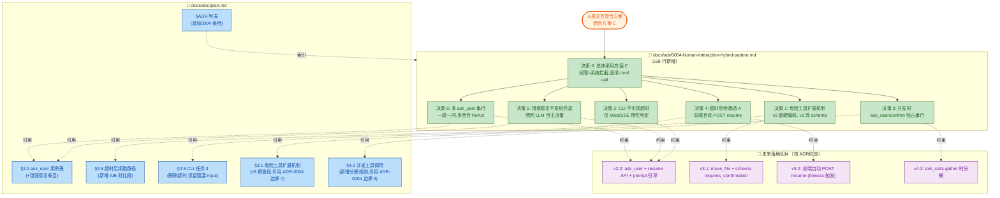

## 1. 高层摘要 (TL;DR)

* **影响范围:** 📚 **文档变更（仅 ADR + plan.md）**——新增一份人机交互总体选型 ADR，并同步刷新 plan.md 的对应章节。**无代码改动**，但对未来 v2.2/v3.1/v3.2/v4.3 的落地切片做了"硬约束"约定。
*   **核心变更:**
    *   ✨ 新增 **`docs/adr/0004-human-interaction-hybrid-pattern.md`**，落地"方案 C"混合人机交互模式（权限走系统拦截层 + 澄清走 agent tool call）。
    *   🔧 `docs/doc/plan.md` 同步在 6 个章节应用 ADR 决策：**ask_user 用例扩充（新增"错误恢复"）、多 ask_user 串行约定、CLI 不实现超时、超时后自动续跑（选 A）、v3 危险工具 schema 化（预告）、v4.3 并发批次分桶**。
    *   📌 在 ADR 索引里追加 ADR-0004 条目，与 plan 双向锚定。

---

## 2. 视觉总览（决策 & 文件关系图）

---

## 3. 详细变更分析

### 📜 A. 新增文档：ADR-0004 人机交互混合方案

**文件:** `docs/adr/0004-human-interaction-hybrid-pattern.md`（**168 行全新文件**）

记录了人机交互总体选型（方案 C）+ **6 个边界决策**，每个边界都附业界先例与选择理由。核心论点是：**对外是"agent 主动 tool call"，内部复用"run_command confirm"模式二的断点管道**——不另起炉灶。

#### A.1 决策矩阵对照表

| # | 边界 | 业界主流做法 | 本项目决策 | 落地切片 |
|---|---|---|---|---|
| 0 | 总体模式 | 三派分歧（HitL-as-Tool / Guardrail / Plan-then-Execute） | **方案 C 混合**：权限=系统层、澄清=agent 层 | — |
| 1 | 危险工具扩展 | schema 声明 `requires_confirmation` | v2 留硬编码 `if name=="run_command"`，v3 改 schema | v3.1 |
| 2 | CLI 超时 | **业界无人做 CLI 超时** | CLI阻塞 `input()` 永不超时；超时只在 Web/SSE | v2.2 |
| 3 | 并发时 ask_user/confirm | LangGraph / AutoGen / Swarm：**交互工具永远先单独处理** | 不参与 `gather`，单独 `yield return` | v4.3 |
| 4 | 超时后续跑路径 | A 自动续跑（OpenAI/LangGraph） vs B 等用户发新消息（Claude Code/Cursor） | **选 A**：前端拉过期 pending 自动 `POST resume` | v2.2(API) + v3.2(前端) |
| 5 | 错误恢复 | 工具结果喂回 LLM 自纠；多次后系统兜底 yield error；**不在系统层主动调 ask_user** | 不在 runner 兜底，靠 prompt 引导 | v2.2(prompt) |
| 6 | 多 ask_user 串行 | A 一段一问（LangGraph/Claude Code） vs B 批量表单（AutoGen） | **选 A**（当前 runner 天然如此） | v2.2（文档约定） |

#### A.2 关键架构选择（决策 0）

> "对外接口是模式一（agent 主动 tool call），**内部执行复用模式二的断点管道**。ask_user 在 schema 形式上是个普通 tool，但执行路径与 confirm 完全一致——runner 拦截后存 `session.pending` + 结束本段 + 等 `resume_turn`。"

**为什么**：断点管道（pending / lock / 断流保半截 / 补 tool 占位）已写好且测过，给 ask_user 单独搞挂起机制是过度工程。

---

### 📘 B. 文档更新：`docs/doc/plan.md`（6 段小改）

| # | 章节 | 变更类型 | 关键内容 |
|---|---|---|---|
| ① | §2.2 ask_user 用例列表 | ➕ 扩列 | 新增第 4 类用例："**错误恢复**：工具连续失败后求助用户（agent 决定要不要问，不是 runner 兜底）" |
| ② | §2.2 防滥用 prompt | ✏️ 改写 | 引导追加："连续 **2 次同工具失败后再考虑 ask_user** 问用户怎么处理"（明确"不是 runner 自动兜底——是否问由 LLM 决策"） |
| ③ | §2.2 多 ask_user 串行约定 | ➕ 新段 | 一段一问，答完 agent 再决定下一个问不问（多回合 ReAct）。**当前 runner 天然就是这套**——一个 ask_user 就 yield return |
| ④ | §2.6 超时后续跑路径 | ➕ 新段 | **A/B 对比**：A 自动续跑 vs B 等用户发新消息，**选 A**。落地时序：API 在 v2.2 已就位，前端触发在 v3.2；v2 阶段接受"超时后僵住"边界 |
| ⑤ | §2.6 任务 3 CLI 侧 | ✏️ 删除"超时" | 改为"CLI 不实现超时，等同 confirm 永不超时——业界共识，CLI 是阻塞 input() 一问一答" |
| ⑥ | §3.1 危险工具扩展机制 | ➕ 新段 | ⚠️ 预告 v3 改造：tool schema 加 `requires_confirmation: bool`，runner 改为 `if _registry.needs_confirm(c["name"])`；v2 不动（避免硬编码 if 蔓延） |
| ⑦ | §4.3 并发工具调用 | ➕ 新段 | ⚠️ ask_user/confirm 类**不参与并发**：执行前分桶 `interactive_calls`（串行）+ `compute_calls`（并行）；引用 ADR-0004 边界 3 |
| ⑧ | ADR 列表 | ➕ 新行 | 追加 ADR-0004 条目："人机交互采用混合方案（方案 C）+ 6 个边界决策 \| 已接受（落地中：权限半边已实现，澄清半边 v2.2）" |

---

### 🧩 C. ask_user 用例与超时语义（关键决策对照）

| 维度 | 旧 plan 描述 | 新 plan/ADR 描述 |
|---|---|---|
| ask_user 用途数 | 3 类（歧义 / 多方案 / 缺信息） | **4 类**（新增：错误恢复——由 LLM 决定是否调用） |
| 失败后行为 | runner注释说"喂回 LLM 自纠"，**没说自纠失败几次后走 ask_user** | 明确"连续 2 次同工具失败后再考虑 ask_user"（prompt 引导，不在 runner 兜底） |
| CLI 超时 | "CLI 侧:ask_user 终端交互 + 超时" | **删除超时**，只阻塞 input；超时仅 Web/SSE |
| 超时后续跑 | 未明确 | **选 A 自动续跑**：前端 `GET sessions` 检测到 pending过期 → 自动 `POST resume(status=timeout)` |
| 多 ask_user | 没明确 | **一段一问**，多回合 ReAct；不要一次返回多个 calls |
| 危险工具扩展 | runner 硬编码 `if name=="run_command"` | v2 保留；**v3 改 schema `requires_confirmation`** |

---

## 4. 风险与影响评估

### ⚠️ 关键约定（无代码风险，但落地后必须遵守）

| 约束 | 触发点 | 落地切片 | 不遵守的后果 |
|---|---|---|---|
| 禁止在 runner 自动调 ask_user 兜底 | v2.2 prompt 设计 | v2.2 | 违反 agent 自主性，越权 |
| CLI 永不实现超时 | CLI 端开发 | v2.2 | 需要后台线程 + 信号打断 `input()`，复杂度不值 |
| ask_user/confirm 不参与 `asyncio.gather` | v4.3 并发改造 | v4.3 | 两个 ask_user 并行会让 call_index 错位、pending 互相覆盖 |
| 危险工具 v3 必须改 schema | v3.1 加 `move_file` | v3.1 | if 分支蔓延，工具作者还得改 runner |
| 超时后前端自动 resume | v3.2 前端 | v3.2 | 否则用户回来看到"卡住的弹框" |

### 📋 Reviewer 必看要点

1. **ADR-0004 决策 0** 的关键架构选择："对外接口=模式一、内部执行=模式二断点管道"——这点需要未来 ask_user 实现者彻底理解，避免又造一套挂起机制。
2. **决策 4 落地时序**——v2.2 仅提供 API，前端触发在 v3.2。v2 阶段（无前端）"超时后僵住"是**已知边界**，靠 curl 手动 resume 验证即可，不必恐慌。
3. **决策 6 现状是天然 A**——当前 runner 实现天然是一段一问，**不改逻辑，只写文档约定**。这条容易被新人误读成"需要新开发"，实则无。
5. **决策 1 v2 不动**——`if c["name"] == "run_command"` 硬编码在 v2 阶段反而清晰（plan §2.6 原则"不引入额外抽象"），**不要因为 ADR 写了 v3 计划就提前改**。
6. **ADR 索引新行**——plan 表格追加了 0004 条目，索引同步对齐。

### ✅ 建议验证场景（文档约定，落地时执行）

| 落地项 | 建议测试场景 |
|---|---|
| ask_user 用例 4（错误恢复） | 工具连续失败 2 次后 agent 主动 ask_user；runner 不应自动触发 |
| CLI 超时 | 长时间不回答，CLI 不应超时退出；与 confirm行为一致 |
| 超时自动续跑（v3.2） | 前端 `GET sessions` 检测到 `pending` 过期 → 自动 POST resume → 用户看到 timeout 结果已落历史 |
| v3 schema 改造（v3.1） | `move_file` 在 schema 里声明 `requires_confirmation: true` 后，runner 不靠硬编码即可拦截 |
| 并发分桶（v4.3） | 同一轮同时含 `ask_user` 和 `read_file`：先 yield return 处理 ask_user，下一段再并行 read_file |

---

## 5. 总结

本次 PR **纯文档变更**：1 个新文件（ADR-0004）+ 1 个文件的 6 处小改。**目的是在落地 v2.2 ask_user 之前，把"人机交互"的 6 个模糊边界一次性钉死**，每个边界都附业界先例与理由，避免后续拍脑袋决定 + 反复改设计。

> 💡 **无代码改动、无 breaking change、无依赖变更**——但请把这份 ADR 当作 v2.2 / v3.1 / v3.2 / v4.3 落地的**硬约束文档**，尤其注意 v2 阶段哪些"暂不实现"的边界（如 CLI 超时、自动续跑前端触发）。