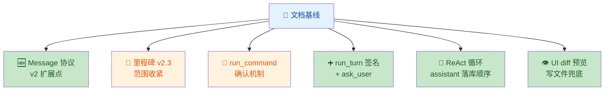
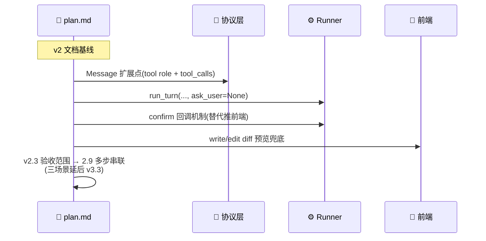

## 1. High-Level Summary (TL;DR) 📋

*   **Impact:** **Low** — 仅文档修改(`docs/doc/plan.md`),无代码逻辑改动,用于修订 v2 阶段的工具协议、确认机制和验收范围。
*   **Key Changes:**
    *   📌 **Message 协议预留 v2 扩展点**:明确 `role="tool"` 与 `tool_calls` 字段将在 v2.0 function calling 改造时一起扩展。
    *   🎯 **里程碑范围收紧**:v2.3 验收从"三场景 + 多步决策"调整为"2.9 多步串联场景",三场景推迟到 v3.3。
    *   🔧 **run_command 确认机制明确化**:从"推前端确认"改为"走 confirm 回调",并补充 CLI 统一输入通道的描述。
    *   ➕ **run_turn 签名扩展**:新增 `ask_user=None` 参数,与 ask_user 工具对齐。
    *   🧩 **ReAct 循环语义补全**:强调 assistant 消息(带 `tool_calls`)必须先落 `messages` 再挂 tool 结果。
    *   👁️ **UI 增加 diff 预览**:write/edit 改动通过前端 diff 预览兜底(因 4.1 决策 v2 不加逐步确认)。

---

## 2. Visual Overview (Code & Logic Map) 🗺️





---

## 3. Detailed Change Analysis 🔍

### 📦 组件:协议层(Message 数据模型)

*   **What Changed:** 在 v1 Message 定义(`content: str`)后新增 v2 扩展说明,明确 `role` 增加 `"tool"` 取值,assistant 消息需携带 `tool_calls` 字段。注释强调 v2.0 function calling 改造时一起扩展,否则 tool 结果缺乏合法载体。
*   **Source:** `docs/doc/plan.md` 第 133 行。

### 📦 组件:里程碑表(v2.3 验收范围)

*   **What Changed:**

| 项目 | 旧描述 | 新描述 | 影响 |
|---|---|---|---|
| v2.3 目标 | 三场景 + 多步决策跑通 | 2.9 多步串联场景跑通(三场景需要 v3 工具,留到 v3.3) | 🎯 收紧 v2.3 验收边界,降低交付风险 |
| v2.3 联调项 | 三场景 + 多步串联验收 | 2.9 多步串联验收(三场景延后 v3.3) | ✅ 与上方对齐 |

### 📦 组件:工具签名(list_recent_files / run_command)

| 工具 | 旧描述 | 新描述 |
|---|---|---|
| `list_recent_files(limit=20)` | SQLite 查询最近访问 | 查最近访问(**v2.1 内存占位,v2.4 换 SQLite**) |
| `run_command(cmd, cwd)` | 执行前推前端确认请求,确认后执行 | 执行前走**确认回调**(WS 推前端 / CLI 走统一输入通道),确认后执行 |

### 📦 组件:Runner(`run_turn` + ReAct 循环)

*   **What Changed:**

    *   ✨ **签名扩展**:新增 `ask_user=None` 参数,与 ask_user 工具对齐。

        ```python
        # 旧
        async def run_turn(session, text, confirm=None, tools=TOOLS):
        # 新
        async def run_turn(session, text, confirm=None, ask_user=None, tools=TOOLS):
        ```

    *   🧩 **循环语义补全**:在解析 `tool_calls_buf` 之前,先 `messages.append(assistant(tool_calls=tool_calls_buf))` —— 强调 assistant 消息必须先落库,再挂 tool 结果,保证上下文中 tool 角色消息有合法父节点。

### 📦 组件:前端 UI(写文件兜底)

*   **What Changed:**

| 位置 | 旧内容 | 新内容 |
|---|---|---|
| UI 描述 | 命令确认弹窗 + ask_user 问答 UI | + **write/edit 改动 diff 预览(4.1 已定:改动可见而非每步确认,v2 不加确认靠这里兜)** |
| 前端 checklist | 4 项 | 5 项 — 新增「write/edit diff 预览(4.1 决策的兜底,v2 不加确认靠它)」 |

---

## 4. Impact & Risk Assessment ⚠️

*   **Breaking Changes:**
    *   ❌ 无 API/Schema 破坏性变更(纯文档)。
    *   ⚠️ **范围变更**:v2.3 验收内容调整,原先依赖"三场景跑通"的冲刺计划需要相应推迟到 v3.3。
    *   ⚠️ **接口预留**:`run_turn` 新增 `ask_user` 参数为预留接口,实现侧需保持向后兼容(默认 `None`)。

*   **Testing Suggestions:**
    *   ✅ 确认 v2.3 后续测试用例已剔除"三场景"相关断言,或标注为 `@skip(reason="deferred to v3.3")`。
    *   ✅ 复核 `run_command` 在 CLI 通道下的确认交互(原"推前端"措辞易遗漏 CLI 路径)。
    *   ✅ 前端 diff 预览模块需进入 v2.3/v2.4 的 UI 排期,避免成为遗留 TODO。
    *   ✅ 文档同步检查:`run_turn` 的 `ask_user` 参数是否在后续代码实现中真的被消费(ask_user 工具拦截逻辑)。