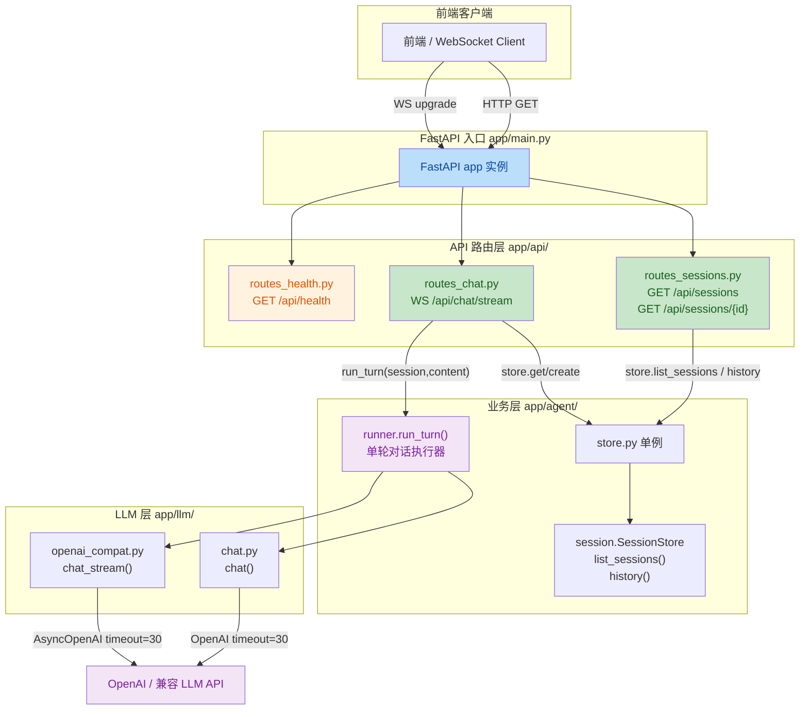

## 1. High-Level Summary (TL;DR)

*   **Impact:** 🔥 **High** - 项目从 **CLI 命令行工具** 重构为 **FastAPI Web 服务**，新增 WebSocket 流式聊天、会话管理、REST API 等核心功能。
*   **Key Changes:**
    *   ✨ **架构重构**：`app/main.py` 从 CLI 入口改为 FastAPI 应用，挂载多个 router。
    *   ✨ **WebSocket 流式聊天**：新增 `routes_chat.py`，支持 `/api/chat/stream` 实时推送事件（chunk/done/error 等）。
    *   ✨ **会话管理 REST API**：新增 `routes_sessions.py`，支持会话列表查询与历史拉取。
    *   ✨ **会话存储扩展**：`SessionStore` 新增 `list_sessions()` 与 `history()` 方法，并抽出统一单例 `app/agent/store.py`。
    *   🐛 **健壮性提升**：OpenAI 同步/异步客户端均添加 `timeout=30`，避免请求长时间挂起；WS 异常不再被吞掉。

---

## 2. Visual Overview (Code & Logic Map)

---

## 3. Detailed Change Analysis

### 🚀 3.1 入口层重构 `app/main.py`

*   **What Changed:** 将原本的 CLI 启动脚本彻底替换为 FastAPI 应用，统一挂载三个 router；同时增加 `uvicorn` 启动入口（支持热重载）。
*   **关键变更：**
    *   删除旧逻辑：`sys.argv` 解析、`loader.load_models()` 直接调用 `chat()`。
    *   新逻辑：实例化 `FastAPI(title="mini-agent")`，依次 `include_router` health / chat / sessions。
    *   启动方式改为 `uvicorn.run("app.main:app", host="127.0.0.1", port=8000, reload=True)`。

### 📡 3.2 WebSocket 流式聊天 `app/api/routes_chat.py`（新文件）

*   **What Changed:** 新增 `chat_stream()` 异步 WS 端点，循环接收前端 JSON 消息并把 `run_turn` 产出的事件转发回去。
*   **核心流程：**
    1. 接受连接 → 循环 `receive_json()`。
    2. 仅处理 `type == "user_message"` 的消息。
    3. 没有 `session_id` 或 session 不存在 → `store.create()` 并下发 `{"type":"session","session_id":...}`。
    4. `async for ev in run_turn(session, content)` 推送 `ev.type/content/message`。
*   **健壮性：** 增加 `except Exception` 打印日志并 `raise`，**不吞异常**（重要修复）。
*   **调试便利：** 每条入站消息、每个事件都 `print` 日志，便于排查。

### 📋 3.3 会话管理 REST API `app/api/routes_sessions.py`（新文件）

| Method | Path | 功能 | 返回 |
| --- | --- | --- | --- |
| GET | `/api/sessions` | 列出所有**未过期**活跃会话摘要 | `{"sessions":[{session_id, messages, preview}, ...]}` |
| GET | `/api/sessions/{session_id}` | 拉取某会话的完整历史 | `{"session_id", "messages":[...]}` 或 **404** |

*   **异常处理：** 若 `history()` 返回 `None`（不存在或已过期），抛 `HTTPException(404, "会话不存在或者已过期")`。

### 💚 3.4 健康检查 `app/api/routes_health.py`（新文件）

*   **What Changed:** 极简健康检查端点：`GET /api/health` → `{"status":"ok","service":"mini-agent"}`。

### 🗄️ 3.5 会话存储层 `app/agent/session.py` + `app/agent/store.py`

*   **`session.py`**：在原 `SessionStore` 类中**新增两个方法**：

| Method | 用途 | 关键点 |
| --- | --- | --- |
| `list_sessions() -> list[dict]` | 枚举活跃会话 | 通过 `now - update_time > ttl` 过滤掉已过期会话；返回 `session_id` / `messages` 数 / 最后一条内容前 30 字预览 |
| `history(session_id) -> list[dict]\|None` | 取完整历史 | 委托给 `self.get()`，返回 `s.messages` 或 `None` |

*   **`store.py`（新文件）**：抽出**单例** `store = SessionStore()`，避免各处 `import SessionStore` 后各自实例化导致会话隔离。

### 🤖 3.6 LLM 客户端超时加固 `app/chat.py` & `app/llm/openai_compat.py`

| 文件 | 客户端 | 修改 |
| --- | --- | --- |
| `app/chat.py` | 同步 `OpenAI` | 增加 `timeout=30` |
| `app/llm/openai_compat.py` | 异步 `AsyncOpenAI` | 增加 `timeout=30` |

*   **Why:** 避免上游 LLM 长时间无响应时，HTTP/WS 请求被无限挂起，提升**故障可观测性**与**服务可用性**。

### 🧪 3.7 测试脚本

*   **`test_ws.py`（新）**：单会话双轮交互，验证 WS 流式输出与**多轮记忆**。
*   **`test_v2.py`（新，v1.2 综合验收）**：
    1. 建两个独立会话（A、B） → 验证会话隔离。
    2. 切回 A 追问 → 验证记忆没串。
    3. 调 REST `/api/sessions` 与 `/api/sessions/{id}` → 验证历史能正确拉取。

---

## 4. Impact & Risk Assessment

### ⚠️ Breaking Changes

*   **运行方式彻底变更**：旧的 `python -m app.main "模型名"` CLI 调用被移除，需改为 `python -m app.main` 启动 uvicorn。
*   **依赖新增**：`fastapi`、`uvicorn`、`websockets`（测试用）必须安装。
*   **依赖 `app.agent.runner.run_turn`**：`routes_chat.py` 依赖 `run_turn(session, content)` 异步生成器，需确保该方法存在且签名一致（本次 diff 未包含 `runner.py`，请审查侧确认）。
*   **`app/api/__init__.py` 为空文件**：仅占位，可能影响某些包级导入路径。

### 🧪 Testing Suggestions

*   **多会话并发**：同时开 3+ 个 WS 客户端，确认 `store` 单例在线程/协程下不会互相覆盖。
*   **TTL 过期边界**：手动调小 TTL，确认 `list_sessions` 过滤生效、`history` 正确返回 `None` 并触发 404。
*   **网络抖动**：`timeout=30` 在上游长时间无响应时表现是否符合预期（建议配合 `pytest` 用 `monkeypatch` 模拟慢响应）。
*   **WS 异常传播**：在 `run_turn` 内部故意抛异常，确认异常不会被 `routes_chat.py` 的 `except` 静默吞掉（已修复，需回归测试）。
*   **REST 参数校验**：`/api/sessions/{session_id}` 没有显式校验格式，恶意/畸形 id 会进入 `store.get`，建议加路径参数正则校验。

### 📦 模块依赖一览

| 模块 | 依赖项 | 状态 |
| --- | --- | --- |
| `routes_chat.py` | `app.agent.runner.run_turn` | ⚠️ 本次 diff 未涉及，需确认实现 |
| `routes_sessions.py` | `app.agent.store.store` | ✅ 新增文件已提供 |
| `routes_health.py` | 无业务依赖 | ✅ 独立 |
| `main.py` | 三个 router | ✅ 全部新增 |
| `chat.py` / `openai_compat.py` | OpenAI 客户端 | ✅ 仅加 `timeout` |

> 📝 **总结**：本次 diff 是典型的 **CLI → Web 服务** 升级，将单进程同步调用升级为基于 FastAPI + WebSocket 的流式服务，配套增加会话管理、REST 探查接口与端到端测试。建议重点关注 `runner.run_turn` 的契约兼容与会话 TTL 边界测试。