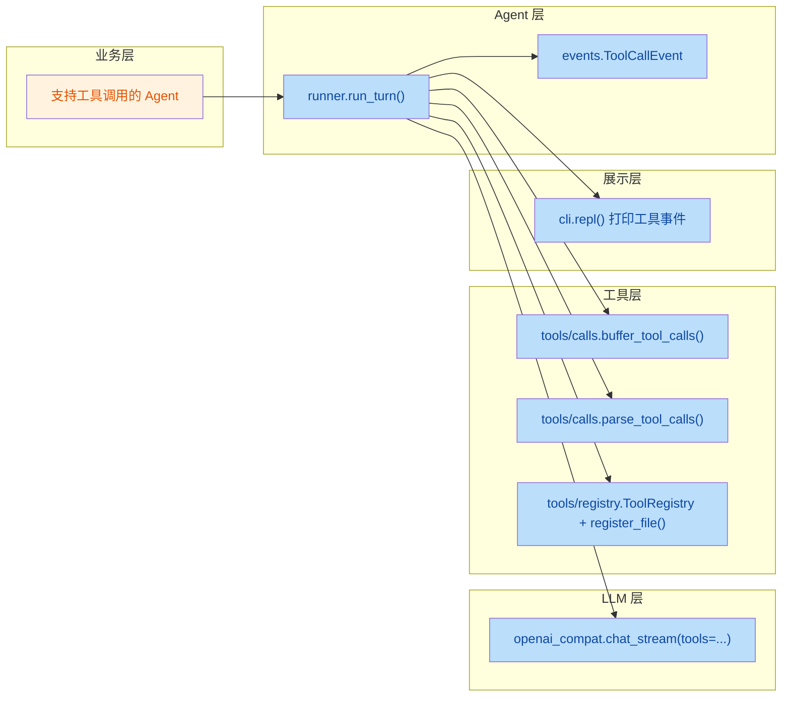

## 1. High-Level Summary (TL;DR)

* **Impact:** **High** —— 本次改动在原有的"单轮流式对话"基础上，引入 **ReAct 工具调用循环**，让 Agent 能够自主调度工具、读取工具结果、继续推理，直到给出最终答案或达到上限。
*   **关键改动:**
    *   - ✨ **新增事件类型** `ToolCallEvent`，用于向 UI 透传工具执行细节。
    *   - 🧠 **`run_turn` 重构**：增加 `MAX_STEPS=6` 的 ReAct 循环、工具注册、assistant tool_calls 消息写入、tool 回执回填、步数耗尽/异常的历史回滚。
    *   - 🛠️ **`chat_stream` 扩展**：支持下发 `tools`，把整段 `delta`（含 `tool_calls` 分片）交回 Runner解析。
    *   - 🧩 **新增 `app/tools/calls.py`**：聚合 OpenAI 流式 `tool_calls` 分片 + JSON 反序列化。
    *   - 🖥️ **CLI 适配**：终端打印 `[调用工具 #n] name 参数=...`。

---

## 2. Visual Overview (Code & Logic Map)

### 2.1 新增 ReAct 主循环（`runner.run_turn`）

```mermaid
flowchart TD
    Start([用户输入 user_text]) --> AppendUser[写入 session: user]
    CacheLen[start_len = 消息快照]
    AppendUser --> CacheLen
    CacheLen --> Loop{step < MAX_STEPS?}
    Loop -- yes --> Clear[重置 full_reply 与 tool_calls_buf]
    Clear --> Stream[chat_stream + tools]
    Stream --> Dispatch{delta 字段}
    Dispatch -- content --> YieldChunk[Yield ChunkEvent 文本]
    Dispatch -- tool_calls --> Buffer[buffer_tool_calls 累积分片]
    YieldChunk --> Stream
    Buffer --> Stream
    Stream --> Check{buf 为空?}
    Check -- yes, 有文本 --> AppendAssistant[追加 assistant 消息]
    AppendAssistant --> Done([Yield DoneEvent])
    Check -- yes, 无文本 --> Done    Check -- no --> Parse[parse_tool_calls]
    Parse --> WriteAssistant[写 assistant 消息含 tool_calls]
    WriteAssistant --> ExecLoop[遍历 calls]
    ExecLoop --> Exec{_registry.execute}
    Exec -- 异常 --> FailResult[结果=错误说明]
    Exec -- 成功 --> OkResult[结果=工具返回]
    FailResult --> AppendTool[写 tool 消息含 tool_call_id]
    OkResult --> AppendTool
    AppendTool --> YieldTool[Yield ToolCallEvent]
    YieldTool --> Loop
    Loop -- no --> StepOver([Yield ErrorEvent: 步数超限])
```

### 2.2 业务目标 ↔ 模块 ↔ 关键方法映射



---

## 3. Detailed Change Analysis

### 🧩 3.1 事件协议层 —— `app/agent/events.py`

*   **What Changed:** 引入 `field` 并新增 `ToolCallEvent`，用于把工具调用过程显式外抛，方便 CLI / WebSocket 渲染。
*   **新增字段表:**

| 字段 | 类型 | 默认值 | 含义 |
|---|---|---|---|
| `type` | `str` | `"tool_call"` | 事件类型标识 |
| `step` | `int` | `0` | 第几轮 ReAct 步骤 |
| `name` | `str` | `""` | 工具名 |
| `args` | `dict` | `field(default_factory=dict)` | 调用参数（已 JSON 反序列化） |
| `result` | `str` | `""` | 工具执行结果字符串 |

### 🧠 3.2 Agent 主流程 —— `app/agent/runner.py`（核心重写）

*   **What Changed:** 由"一次性流式补全"升级为带工具的 ReAct 循环。
*   **关键设计点:**
    *   **模块级 `ToolRegistry`**：进程启动时一次性 `register_file(_registry)`，避免每次请求重复注册。
    *   **`MAX_STEPS = 6`**：防止模型持续调工具耗资源。
    *   **`start_len` 快照**：异常时通过 `del session.messages[start_len:]` 回滚到本轮起点，比原先"只删一条 user"更稳健，能兼容含 tool 消息的复杂历史。
    *   **assistant 消息合并写入**：`content` 与 `tool_calls` 写进同一条消息，否则下一轮模型看不到自己本轮的"决定"，上下文丢失。
    *   **arguments 序列化回 JSON 字符串**：`parse_tool_calls` 已 `json.loads`，写回历史时再 `json.dumps(..., ensure_ascii=False)` 还原协议要求。
    *   **tool 消息必须带 `tool_call_id`**：缺失会被 OpenAI 接口 400。
    *   **业务异常不中断**：用 `try/except` 把异常转成 `"工具执行失败: {e}"` 喂回模型，让模型自行恢复。

### 🔌 3.3 LLM 适配层 —— `app/llm/openai_compat.py`

*   **What Changed:** `chat_stream` 增加 `tools=None` 参数，并把 yield 由"纯文本 delta.content"改为"整段 `delta` 对象"，让 Runner 能解析 `tool_calls` 分片。
*   **签名演进:**

| 参数 | 旧 | 新 |
|---|---|---|
| `messages` | ✅ | ✅ |
| `model` | ✅ | ✅ |
| `cfg` | ✅ | ✅ |
| `tools` | ❌ | ✅（dict列表或 None） |

*   **请求构造方式:**改为先组装 `kwargs`，仅在 `tools` 非空时塞入，避免对未提供工具的 provider 触发400。

### 🧪 3.4 工具调用协议层 —— `app/tools/calls.py`（新文件）

*   **What Changed:** 提供两个纯函数，用于把 OpenAI 流式 `tool_calls` 分片聚合成结构化调用对象。

| 函数 | 输入 | 输出 | 职责 |
|---|---|---|---|
| `buffer_tool_calls(buf, deltas)` | `dict[int, dict]`, `list[delta]` | `None`（就地修改） | 按 `index` 归位；首片写入 `id` / `name`，后续片只追加 `arguments` |
| `parse_tool_calls(buf)` | `dict[int, dict]` | `list[dict]` | 校验 `id` / `name` 非空后 `json.loads(arguments)`，组装最终结构 |

### 🖥️ 3.5 终端展示层 —— `app/cli.py`

*   **What Changed:** `repl` 的事件分派增加 `tool_call` 分支，实时打印工具调用信息（含步骤号、工具名、参数）。
*   **示例输出:**
    ```
    [调用工具 #1] read_file 参数={"path": "/tmp/x.txt"}
    ```
    依赖新引入的 `import json`（用于 `ensure_ascii=False` 序列化中文参数）。

---

## 4. Impact & Risk Assessment

### ⚠️ 4.1 兼容性 / Breaking Changes

| 影响点 | 说明 |
|---|---|
| **`chat_stream` 返回类型** | 由 `yield str` 改为 `yield Delta` 对象。**任何旧消费者**若仍按字符串读取会立刻报错，需同步更新。 |
| **`run_turn` 事件联合类型** | 新增 `ToolCallEvent`，分派逻辑未覆盖该类型的旧代码会静默忽略事件。 |
| **`session` 历史结构** | 新增 `tool_calls` 字段、`tool` 角色消息。旧的 session 持久化（如有）向下兼容，但向前读取旧 session 时 `tool_call_id` 可能缺失。 |

### 🐛 4.2 已知风险点

1.  **`runner.py` 缩进疑似错位**：diff 中第 32 行的 `#2.用整个 session 历史调 LLM` 注释停留在 `for step` 之外，而后续 `async for delta` 缩进在 `for` 内 —— 实际逻辑正确，但需复核格式化是否一致（建议本地跑 `ruff/black`）。
2.  **`full_reply` 在 finally 中再被检查**：异常分支已清空 `full_reply`，但 finally 仍走"最后一条 role == user 才补写"逻辑；这是有意为之，但要警惕异常路径下 `session.messages` 为空时的边界（已加 `session.messages` 非空判断）。
3.  **工具执行 `try/except` 粒度较粗**：任何异常都吞掉，可能掩盖真正的 bug；建议区分"业务失败（应回灌模型）"与"代码 bug（应 raise）"。

### ✅ 4.3 测试建议

| 场景 | 期望行为 |
|---|---|
| 模型不调工具，直接回答 | `tool_calls_buf` 为空 → 立即 `DoneEvent`，仅追加一条 assistant 消息 |
| 模型连续调工具，最终收敛 | 多轮循环，`session` 出现 `assistant(tool_calls)` + 多条 `tool` 消息 |
| 工具参数 JSON 半截到来 | `buffer_tool_calls` 累积不报错，`parse_tool_calls` 在最后一刻 `json.loads` |
| 工具抛异常（文件不存在等） | 历史中写入 `"工具执行失败: ..."`，模型下一轮可能换路径或解释 |
| 连续 6 轮都在调工具 | `ErrorEvent(message="执行步数超限：连续 6 轮都在调工具")` |
| 用户中断（`KeyboardInterrupt`） | `finally` 把已流出文本补写回历史 |
| LLM 接口报错 | `del session.messages[start_len:]` 干净回滚，不留半截 user消息 |
| CLI 中含中文工具参数 | `json.dumps(..., ensure_ascii=False)` 保证不出现 `\uXXXX` 转义 |

---

### 📝 5. 文件改动一览

| 文件 | 性质 | 行数变化概览 |
|---|---|---|
| `app/agent/events.py` | ✏️ 修改 | +8 行（新增 `ToolCallEvent`） |
| `app/agent/runner.py` | 🔧 重构 | 34 → 90 行（ReAct 循环 + 工具执行 + 异常处理） |
| `app/cli.py` | ✏️ 修改 | +3 行（新增 `tool_call` 事件分支 + `import json`） |
| `app/llm/openai_compat.py` | ✏️ 修改 | `chat_stream` 增加 `tools` 参数，yield 改为 `delta` 对象 |
| `app/tools/calls.py` | 🆕 新增 | 29 行（`buffer_tool_calls` + `parse_tool_calls`） |